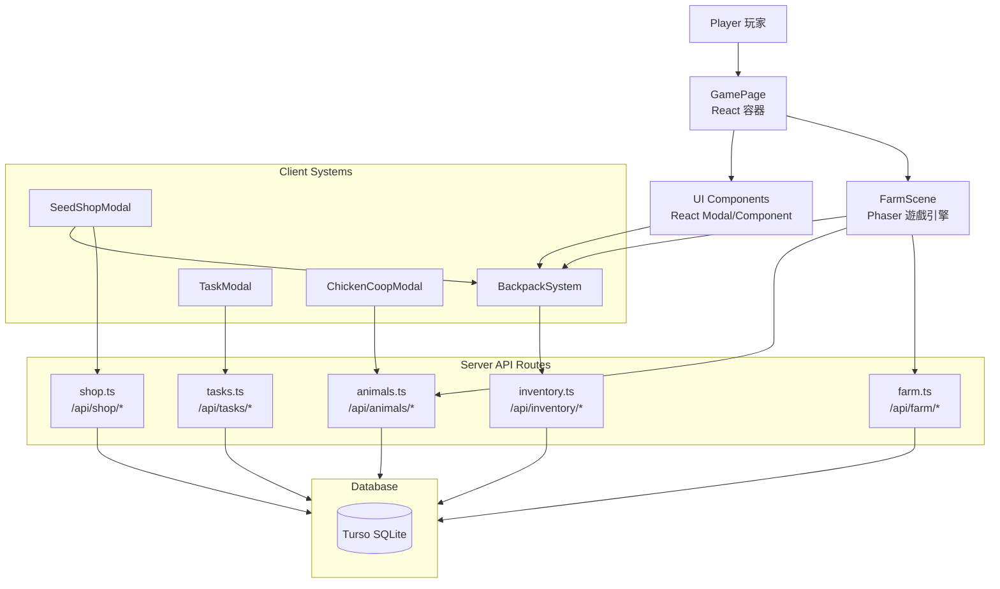

# TLO Farm 系統架構（ARCHITECTURE）

> 建立時間：2026-07-01  
> 目前穩定基準：commit `cd93b5f` + 備份版本 `tlo-farm-live-backup-20260701-1534`  
> 屬於：T-LO Farm 開發規範 v1.0

---

## 一、整體系統架構



**層次說明：**

```
┌─────────────────────────────────────┐
│  Layer 5: Player / UI              │  ← React Modal, Component
├─────────────────────────────────────┤
│  Layer 4: Client Systems           │  ← BackpackSystem, Shop Logic
├─────────────────────────────────────┤
│  Layer 3: FarmScene                │  ← Phaser 遊戲引擎，唯一 Bridge
├─────────────────────────────────────┤
│  Layer 2: Server API Routes        │  ← farm.ts, shop.ts, tasks.ts
├─────────────────────────────────────┤
│  Layer 1: Database                 │  ← Turso SQLite
└─────────────────────────────────────┘
```

---

## 二、主要模組說明

### 2.1 Client 端

| 模組 | 檔案 | 行數 | 職責 |
|------|------|------|------|
| GamePage | `pages/GamePage.tsx` | 1066 | React 容器，13個 modal 狀態，Phaser mount |
| FarmScene | `scenes/FarmScene.ts` | 3928 | 遊戲引擎核心，14種功能（見高風險章節） |
| BackpackSystem | `systems/BackpackSystem.ts` | 378 | 背包狀態中心，5種職責 |
| BackpackModal | `components/ui/BackpackModal.tsx` | 321 | 背包 UI，tab 切換 |
| SeedShopModal | `components/ui/SeedShopModal.tsx` | 879 | 商店 UI，購買邏輯 |
| TaskModal | `components/ui/TaskModal.tsx` | 304 | 每日任務 UI |
| ChickenCoopModal | `components/ui/ChickenCoopModal.tsx` | - | 雞舍 UI（與 FarmScene DOM panel 並存）|

### 2.2 Server 端

| 模組 | 檔案 | 職責 |
|------|------|------|
| farm.ts | `routes/farm.ts` | 農場 API：status/plant/harvest/water/fertilize/clear-withered/plot unlock |
| inventory.ts | `routes/inventory.ts` | 背包 API：get/sell |
| shop.ts | `routes/shop.ts` | 商店 API：buy |
| tasks.ts | `routes/tasks.ts` | 任務 API：daily tasks |
| animals.ts | `routes/animals.ts` | 雞舍 API：chicken-coop/status/feed/collect/place |

---

## 三、完整資料流

### 3.1 商店購買資料流

```
Player
  ↓ 點擊購買
SeedShopModal
  ↓ POST /api/shop/buy
shop.ts → DB (users.gold, inventories)
  ↓
BackpackSystem.fetchAll()
  ↓
BackpackModal re-render
  ↓
背包顯示更新
```

**關鍵呼叫鏈：**
```
SeedShopModal → BackpackSystem.fetchAll() → BackpackModal
              ↗ BackpackSystem.state 更新
```

### 3.2 播種資料流

```
Player 點擊農地
  ↓
FarmScene.onFarmClick()
  ↓
FarmScene.showSeedPopup() → UI 顯示
  ↓ 選擇種子
FarmScene.plantCrop()
  ↓ POST /api/farm/plant
farm.ts → DB (farm_tiles INSERT)
  ↓
FarmScene.syncFarmState() → renderFarmland()
  ↓
FarmScene.backpackSystem.deductItem('seed')
  ↓
BackpackSystem.fetchAll()
  ↓
BackpackModal 更新
```

**關鍵呼叫鏈：**
```
FarmScene → farm.ts → DB
         ↘ BackpackSystem.deductItem → BackpackSystem.fetchAll → BackpackModal
```

### 3.3 收成資料流

```
Player 點擊成熟農地
  ↓
FarmScene.harvestCrop()
  ↓ POST /api/farm/harvest
farm.ts → DB (farm_tiles + inventories INSERT)
  ↓
farm.ts → updateTaskProgress('harvest') → tasks.ts
  ↓
FarmScene.backpackSystem.addItem('crop')
  ↓
BackpackSystem.fetchAll()
  ↓
BackpackModal 更新
  ↓
TaskModal 進度更新（下次開啟時）
```

**關鍵呼叫鏈：**
```
FarmScene → farm.ts → DB
         ↘ updateTaskProgress → tasks.ts
         ↘ BackpackSystem.addItem → BackpackSystem.fetchAll → BackpackModal
```

### 3.4 雞舍資料流

```
FarmScene DOM Panel (HTML in Phaser)
  ↓
GET /api/animals/chicken-coop/status
  ↓
ChickenAPI → DB (animals, chicken_coops)
  ↓
FarmScene.renderChickenCoop() / refreshCoopPanelStatus()
  ↓
POST /api/animals/chicken-coop/feed-all
  ↓
FarmScene.backpackSystem.fetchAll()
  ↓
BackpackModal 更新
```

**關鍵呼叫鏈：**
```
FarmScene DOM Panel ↔ ChickenAPI → DB
                  ↘ BackpackSystem.fetchAll → BackpackModal
```

### 3.5 每日任務更新資料流

```
farm.ts updateTaskProgress('harvest')
  ↓
POST /api/tasks/update (internal)
  ↓
TaskModal 開啟時
  ↓ GET /api/tasks/daily
tasks.ts
  ↓
TaskModal 顯示進度
```

**注意：** 收成當下不主動通知 TaskModal，是下次開啟 TaskModal 時才 fetch 最新進度。

---

## 四、高風險模組分析

### 4.1 FarmScene.ts（3928行）— 最高風險

| 屬性 | 內容 |
|------|------|
| 行數 | 3928 |
| 現負責功能 | 14種（見下）|
| 被依賴 | GamePage（mount）、幾乎所有 Server API |
| 風險原因 | 所有遊戲核心邏輯全部擠在一個檔案，修改任何一行都可能影響其他功能 |

**現負責 14 種功能：**
1. 農地 tile render（3×2 排列）
2. 作物播種視覺
3. 澆水視覺
4. 施肥視覺
5. 作物成長計時（progress bar）
6. 收成視覺
7. 乾旱狀態（dry）
8. 枯萎狀態（withered）
9. 雞舍 render（sprite）
10. 雞舍 DOM panel（HTML overlay）
11. 放置系統（ghost/preview/validity check）
12. 點擊 popup / seed popup
13. 成熟/乾旱/枯萎 指示器
14. 雞舍 poll timer / withering timer

### 4.2 GamePage.tsx（1066行）

| 屬性 | 內容 |
|------|------|
| 行數 | 1066 |
| 現負責功能 | 13種 modal 狀態 + Phaser mount + gold display |
| 被依賴 | 所有 Modal 元件、BackpackSystem |
| 風險原因 | 13個 modal 的 open/close 狀態全部集中在一個 React 元件，任意一個 modal 改壞都會影響整體 |

### 4.3 farm.ts（994行）

| 屬性 | 內容 |
|------|------|
| 行數 | 994 |
| 現負責功能 | 9種 API（status/plant/harvest/water/fertilize/clear-withered/plot unlock/reset/debug-task-progress）|
| 被依賴 | FarmScene（唯一 consumer）|
| 風險原因 | 所有遊戲 business logic（種植/養殖/每日任務）全塞在一個 route 檔案 |

### 4.4 BackpackSystem.ts（378行）

| 屬性 | 內容 |
|------|------|
| 行數 | 378 |
| 現負責功能 | seeds/crops/items/fertilizers/livestock 狀態 + fetchAll + sell + add + deduct |
| 被依賴 | BackpackModal、FarmScene、SeedShopModal |
| 風險原因 | 多個系統都直接依賴同一個 BackpackSystem instance，一處改錯全部受影響 |

### 4.5 SeedShopModal.tsx（879行）

| 屬性 | 內容 |
|------|------|
| 行數 | 879 |
| 現負責功能 | 商店tab/購買行為/背包扣量/背包同步 |
| 被依賴 | BackpackSystem |
| 風險原因 | 購買邏輯與背包狀態操作混在一起 |

---

## 五、API 路由清單

| 路由 | Method | 檔案 | 主要消費者 |
|------|--------|------|-----------|
| `/api/farm/status` | GET | farm.ts | FarmScene |
| `/api/farm/tiles` | GET | farm.ts | FarmScene |
| `/api/farm/plant` | POST | farm.ts | FarmScene |
| `/api/farm/harvest` | POST | farm.ts | FarmScene |
| `/api/farm/water` | POST | farm.ts | FarmScene |
| `/api/farm/fertilize` | POST | farm.ts | FarmScene |
| `/api/farm/clear-withered` | POST | farm.ts | FarmScene |
| `/api/farm/tile/update` | POST | farm.ts | FarmScene |
| `/api/farm/plots` | GET | farm.ts | FarmScene（未啟用）|
| `/api/farm/plots/unlock` | POST | farm.ts | FarmScene（未啟用）|
| `/api/farm/plots/place` | POST | farm.ts | FarmScene（未啟用）|
| `/api/animals/chicken-coop/status` | GET | animals.ts | FarmScene |
| `/api/animals/chicken-coop/feed-all` | POST | animals.ts | FarmScene DOM |
| `/api/animals/chicken-coop/collect-all` | POST | animals.ts | FarmScene DOM |
| `/api/animals/chicken-coop/place` | POST | animals.ts | FarmScene |
| `/api/inventory` | GET | inventory.ts | BackpackSystem |
| `/api/shop/buy` | POST | shop.ts | SeedShopModal |
| `/api/shop/sell` | POST | shop.ts | BackpackModal |
| `/api/tasks/daily` | GET | tasks.ts | TaskModal |
| `/api/tasks/claim` | POST | tasks.ts | TaskModal |
| `/api/tasks/update` | POST | tasks.ts | farm.ts（internal）|

**結論：幾乎所有 `/api/farm/*` 和 `/api/animals/*` 都只有一個消費者（FarmScene），沒有跨系統共用的問題。真正的耦合在 Client 端。**

---

## 六、DB Schema 現況

| Table | 用途 |
|-------|------|
| `users` | 玩家資料（id/account/nickname/level/exp/gold）|
| `farm_tiles` | 農地狀態（x/y/crop_id/state/planted_at/finish_at）|
| `inventories` | 背包（user_id/item_type/item_id/amount）|
| `crops` | 作物靜態資料（name/grow_time/sell_price/buy_price/exp/sprite）|
| `orders` | 訂單（npc/requirements/reward/status/expires_at）|
| `refresh_tokens` | 登入 session |

**已知缺口（不在目前 schema）：**
- 無「持有農地數」概念（`farm_tiles` = 已放置）
- 無「佔格 grid」機制
- 無「建築/裝飾品」持有多寡
- 無 `level_unlocks` 啟用邏輯

---

## 七、Case Study：為什麼做農地解鎖，卻影響了玩家等級、雞舍、商店、農地大小

### 事件摘要

2026-06，嘗試實作「農地解鎖」功能，結果造成：
- 玩家等級資料損壞
- 雞舍位置錯亂
- 商店購買異常
- 農地大小不如預期

### 真正原因分析

```
不是「農地解鎖」功能本身的問題。
是高耦合架構的必然結果。
```

**高耦合示意圖：**

```
FarmScene.ts（3928行）
    ├── 呼叫 /api/farm/* → farm.ts
    ├── 呼叫 BackpackSystem
    ├── 呼叫 /api/animals/chicken-coop/*
    ├── 呼叫 /api/shop/*
    └── 管理雞舍 DOM panel
         ↕
    GamePage.tsx（1066行）
         ├── 13個 modal 狀態
         └── 任何一個 modal 改壞 → 全壞
```

**當時「農地解鎖」碰了：**
1. `FarmScene.ts` — 修改了農地 layout 邏輯（COLS/ROWS）
2. `farm.ts` — 修改了 `/status` API 與 auto-INSERT 邏輯
3. `farm_tiles` 表 — 語意被改變（從「已放置」變成「持有」）

**為什麼影響了雞舍：**
- 雞舍的 `placeChickenCoopLocal()` 依賴 `farmStartX/Y` 計算
- `layoutFarmlands()` 改了，雞舍位置全部錯位

**為什麼影響了玩家等級：**
- `farm.ts` 的 `/status` API 同時回傳 `user` 資料
- 修改 tile 初始化邏輯時，誤觸了 user 相關的欄位

**為什麼影響了商店：**
- `BackpackSystem.fetchAll()` 在 `FarmScene` 的多個事件中被呼叫
- 任何 `FarmScene` 的變更都可能影響 `fetchAll()` 的觸發時機
- 商店購買依賴 `BackpackSystem` 即時更新

**為什麼影響了農地大小：**
- Client `COLS=3, ROWS=2` hardcode
- Server 給了更多 tile，但 Client 只 render 前 6 格
- 兩邊數量不一致

### 教訓

```
任何直接修改 FarmScene / farm.ts / GamePage 的行為，
都如同在蛛網中心拉動一根絲。
結果不是影響一個功能，而是影響全部。
```

### 避免方式

1. **隔離式開發**：新功能必須建立獨立模組，不碰高風險檔案
2. **影響範圍分析**：每次修改前確認會影響哪些檔案
3. **單向資料流**：嚴格遵守 UI → System → API → DB
4. **禁止跨層呼叫**：UI 不能直接碰 DB，FarmScene 不能直接操作 Backpack business logic
